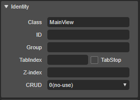
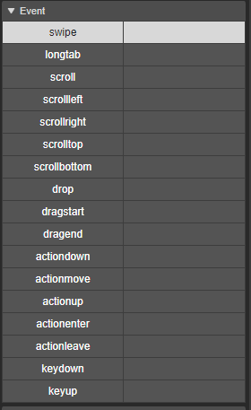
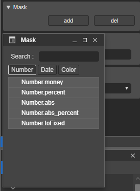
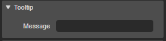
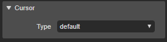

# 2.4.1. Class Pane

Class Pane은 컴포넌트의 **Identity, Event, Query, Mask, ToolTip, Cursor Type** 등의 속성값을 설정 할 수 있습니다.

* **Identity : **컴포넌트의 구분 및 유일성을 위한 ID, Group, TabIndex, Z-index, CRUD 값을 설정 할 수 있습니다.
  * **Class **: 컴포넌트의 클래스명 \(Base Class\)
  * **ID **: 컴포넌트를 구분하기 위한 유일한 아이디
  * **Group **: 컴포넌트를 그룹화하기 위한 그룹 아이디
  * **TabIndex **: 컴포넌트의 탭 순서
  * **Z-Index** : 컴포넌트의 레이어\(Layer\) 값
  * **CRUD** : CRUD 매핑 값 \(CRUD를 위한 서버 연동시 적용됨\)
* **Event **: 컴포넌트의 이벤트를 설정 할 수 있습니다. 설정하기 위한 이벤트 컬럼을 더블클릭하면 이벤트를 설정할 수 있습니다. 각이벤트에 대해서는 [6.이벤트](https://github.com/asoosoft/spidergen-guidebook/tree/eeac9656bff5b368e79bf9dad544cae218642e17/c774-bca4-d2b8.md)를 참고해주세요.

* **Query** : 컴포넌트에 매핑된 쿼리를 설정 및 수정 할 수있습니다.
* **Mask** : 컴포넌트에 마스킹을 설정할 수 있습니다. add 버튼을 클릭하면 사용 가능한 마스크 리스트를 확인 할 수 있습니다.

* **ToolTip **: 컴포넌트에 툴팁을 설정 할 수 있습니다. Message에 툴팁에 노출될 내용을 입력하세요.

* **Cursor Type** : 컴포넌트의 마우스 커서를 설정 할 수 있습니다.

