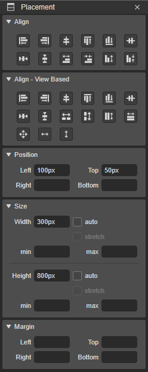

# 2.4.3. Placement Pane

Placement pane은 컴포넌트의 위치, 사이즈, 마진 값을 설정 할 수 있습니다.

* **Align** : 선택된 컴포넌트들을 정렬을 설정합니다.
* **Align - View Based** : 컴포넌트를 담고 있는 뷰를 기준으로 선택된 컴포넌트들을 정렬합니다.
* **Position** : 컴포넌트의 위치를 설정합니다. 픽셀 또는 % 로 설정이 가능합니다.
* **Size** : 컴포넌트의 크기를 설정합니다. 픽셀 또는 % 로 설정이 가능합니다.
  * auto : 크기를 auto로 설정 합니다.
  * stretch : Width가 설정되어 있을 경우는 Left 또는 Right,  Height가 설정되어 있을 경우는 Top, Bottom 설정값을 기준으로 상대편 간격값을 설정 할 수 있습니다.
* **Margin** : 컴포넌트의 마진 값을 설정 할 수 있습니다.

