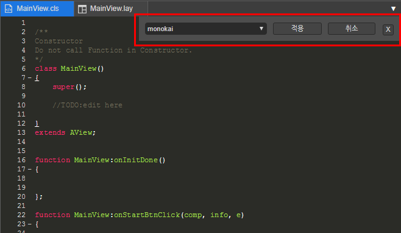
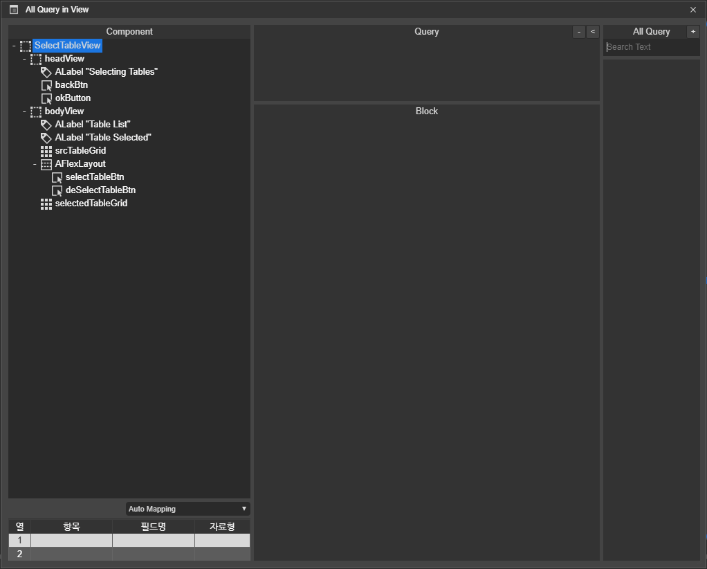

# 3.3. View

* **Open Matching** : 클래스 파일\(\*.cls\) 또는 레이아웃 파일\(\* .lay\)에 매칭되는 클래스 또는 레이아웃 파일을 오픈하거나 이미 오픈 되어 있을 경우 현재 작업중인 파일로 활성화 합니다. 해당 기능은 레이아웃뷰의 상단의 탭바에서 현재 활성화된 탭을 더블 클릭할 경우에도 동일한 기능을 수행합니다.
* **Project** : Project Pane이 비활성화\(Hide\) 되어 있을 경우 활성화\(Show\) 합니다.

* **Component** : Component Pane이 비활성화\(Hide\) 되어 있을 경우 활성화\(Show\) 합니다. 

* **Query** : Query Pane 이 비활성화\(Hide\) 되어 있을 경우 활성화\(Show\) 합니다. 

* **Class** :  Class Pane 이 비활성화\(Hide\) 되어 있을 경우 활성화\(Show\) 합니다.

* **Appearance** : Appearance Pane 이 비활성화\(Hide\) 되어 있을 경우 활성화\(Show\) 합니다.

* **Placement** : Placement Pane 이 비활성화\(Hide\) 되어 있을 경우 활성화\(Show\) 합니다.

* **Console** : Console Pane 이 비활성화\(Hide\) 되어 있을 경우 활성화\(Show\) 합니다.

* **Code Theme** : 코드 테마를 설정 할 수 있습니다. 해당 기능은 코드뷰 상태에서만 실행되며 적용 할 수 있습니다. 

* **All Query in View** : 현재 화면에 매핑된 모든 쿼리 정보를 확인 할 수 있고 설정 할 수 있습니다.

