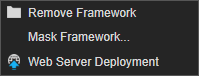

# 4.1.3. on Framework node

프로젝트에 추가된 프레임워크 노드에서 제공하는 컨텍스트 메뉴 입니다.

* **Remove Framework** : 선택된 프레임워크를 삭제하는 기능입니다.
* **Mask Framework** : 선택된 프레임워크의 마스크 셋팅을 하는 기능입니다. 선택된 프레임워크의 컴포넌트는 프로젝트 실행시 로드됩니다. 스파이더젠의 Project Prop의 Build 옵션에서 lay 파일이 로드될 때 컴포넌트 파일 로드 항목이 설정되어 있을 경우 선택되지 않은 컴포넌트는 사용되는 시점에 동적으로 로드됩니다. 
* **Web Server Deployment** : 선택된 프레임워크를 설정된 배포 URL로 배포합니다.

