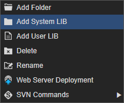
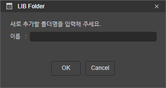
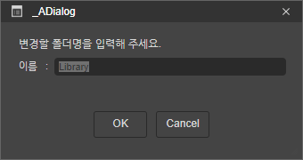
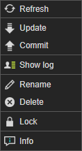

# 4.1.4. on Library folder

Library 폴더에서 제공되는 컨텍스트 메뉴입니다.

* **Add Folder** : Library 폴더 내에 새 폴더를 생성하고 추가하는 기능입니다. 오픈된 다이얼로그에서 폴더명을 입력하고 실행하면 새폴더가 추가 됩니다. 
* **Add System LIB** : 스파이더젠 시스템에서 라이브러리를 추가하는 기능 입니다. 오픈된 다이얼로그에서 추가할 라이브러리를 더블클릭으로 선택하면 추가됩니다. 
* **Add User LIB** : 외부 Library를 추가하는 기능입니다. 선택시 파일탐색기 창이 오픈되고 선택한 라이브러리가 추가됩니다.
* **Delete** : Library 폴더를 삭제하는 기능입니다. 오픈된 다이얼로그에서 예를 선택하면 프로젝트에서 삭제됩니다. 파일삭제를 선택하면 프로젝트에서 삭제되고 물리적인 파일도 삭제됩니다. 
* **Rename** : Library 폴더명을 변경하는 기능입니다. 오픈된 다이얼로그에서 변경할 폴더명을 입력하고 저장하면 폴더명이 변경됩니다. 
* **Web Server Deployment** : Library 폴더내 모든 라이브러리 파일을 설정된 배포 URL로 배포 합니다.
* **SVN Commands** :  형상관리 모드일 경우 노출되는 메뉴 입니다.
  * **Refresh** : 폴더내 형상관리 상태를 새로고침 하는 기능입니다.
  * **Update** : 폴더내 형상관리 상태중 Update가 필요한 모든 파일을 일괄 Update 받게 해주는 기능입니다.
  * **Commit** : 폴더내 형상관리 상태중 Commit이 필요한 모든 파일을 일괄 Commit 하게 해주는 기능입니다. 충돌방지 모드에서는 노출되지 않습니다.
  * **Show log** :  형상관리 로그를 확인 할 수 있는 다이얼로를 실행하는 기능입니다.
  * **Rename** : 형상관리 상태에서 폴더명을 변경하는 기능입니다.
  * **Delete** : 형상관리 상태에서 폴더를 삭제하는 기능입니다. 충돌방지 모드에서는 노출되지 않습니다.
  * **Lock** : 폴더내 Lock 상태가 가능한 모든 파일을 Lock 상태로 변경하는 기능입니다. 충돌방지 모드에서는 노출되지 않습니다. 
  * **Unlock** :  폴더내 Lock 상태인 모든 파일을 Unlock 상태로 변경하는 기능입니다.

