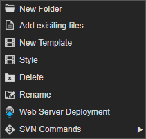

# 4.1.5. on Template folder

Template 폴더에서 제공되는 컨텍스트 메뉴입니다.

* **New Folder** : Template 폴더내 새로운 폴더를 생성하는 기능입니다. 오픈된 다이얼로그에 추가할 폴더명을 입력하고 실행하면 Template 폴더내 새로운 폴더가 생성됩니다. 
* **Add existing files** : Template 폴더내에 이미 물리적으로 존재하는 파일을 로드하는 기능입니다.
* **New Template** : 새 Template를 생성하는 기능입니다. 오픈된 다이얼로그에서 템플릿명을 입력하고 실행하면 **.tpl, .stl, .tlay** 3개의 템플릿 관련 파일이 생성됩니다. 
* **Style** : 새 스타일 파일을 생성하는 기능입니다. 오픈된 다이어로그에서 스타일 명을 입력하고 실행하면 .**stl** 파일이 생성됩니다. 
* **Delete** : Template 폴더를 삭제하는 기능입니다.
* **Rename **: Template 폴더명을 변경하는 기능입니다.
* **Web Server Deployment** : Template 폴더내 모든 파일을 설정된 배포 URL로 배포하는 기능입니다.
* **SVN Commands** : 형상관리 기능을 제공합니다.

