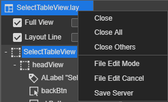

# 4.2.1. on Main TabBar

레이아웃뷰의 메인 탭바에서 제공하는 컨텍스 메뉴입니다.

* **Close** : 현재 활성화된 탭의 파일을 닫습니다.
* **Close All** : 현재 오픈되어 있는 모든 파일을 닫습니다.
* **Close Others** : 현재 활성화된 탭의 파일만오픈되어 있는 모든 파일을 닫습니다. 제외하고
* **File Edit Mode** : 충돌방지 모드일 경우 노출됩니다. 활성화된 파일의 수정 권한을 설정합니다.
* **File Edit Cancel** : 충동방지 모드일 겨우 노출됩니다. 수정 권한을 취소합니다. 수정된 내용도 취소됩니다.
* **Save Server** : 충돌방지 모드일 경우 노출됩니다. 수정을 완료한 후 서버에 적용하는 기능입니다. 적용이 완료되면 수정 권한은 반환되고 파일은 읽기 모드로 전환 됩니다.

