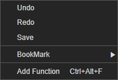
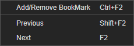

# 4.2.3. on Code Area

코드 영역에서 제공하는 컨텍스트 메뉴 입니다.

* **Undo** : 이전 실행을 취소하는 기능입니다.
* **Redo **: 이전 취소을 다시 실행하는 기능입니다.
* **Save **: 현재 작업중인 문서를 저장합니다.
* **BookMark **: 현재 작업중인 코드에 포커싱된 라인을 북마크하는 기능입니다. 
  * **Add/Remove BookMark** : 현재 포커싱된 코드 라인을 북마크 하거나 삭제합니다.
  * **Previous **: 북마크된 라인들은 설정 역순으로 찾아서 포커스를 이동합니다.
  * **Next **: 북마크된 라인들을 설정 순서로 찾아서 이동합니다.
* **Add Function** : 함수를 추가하는 기능입니다. 
  * **Class **: 함수를 추가하는 클래스명  
  * **Function Name** : 추가할 함수명  
  * **Parameter** : 함수에 파라미터 여러개일 경우 \(,\)콤마로 구분하여 입력합니다.

