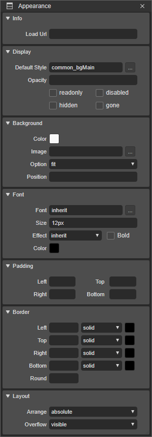

# 5.2 Properties in Appearance Pane

Appearance pane의 공통 속성입니다.

Appearance Pane은 각 컴포넌트마다 속성을 설정할 수 있는 뷰입니다. 글로벌 속성에서는 컴포넌트의 공통적인 속성만 설명합니다.

나머지 특징적 속성은 각 컴포넌트 설명에서 참고해 주십시오.

* **Display** : 컴포넌트의 스타일 속성 및 display 상태를 설정하는 기능입니다.
  * **Default Style** : 기본적으로 컴포넌트에 적용될 스타일을 적용하는 속성입니다. 
  * **Opacity** : 컴포넌트의 투명도를 설정하는 속성입니다. 0과 1 사이값을 입력하세요.
  * **readonly** : Input 계열의 컴포넌트일 경우 읽기만 가능하게 하는 속성입니다.
  * **disabled** : 컴포넌트의 비활성을 설정하는 속성입니다.
  * **hidden** : 컴포넌트의 visibility를 설정하는 속성입니다. 해당 속성을 설정하면 보이지는 않지만 컴포넌트의 영역이 그대로 존재합니다.
  * **gone** : 컴포넌트의 display를 설정하는 속성입니다. 해당 속성을 설정하면 hidden과 달리 컴포넌트 영역도 보여지지 않습니다.
* **Background** : 컴포넌트의 배경을 설정하는 기능입니다.
  * **Color** : 배경색을 설정하는 기능입니다. 
  * **Image** : 배경에 삽입될 이미지를 설정하는 기능입니다. 
  * **Option** : 배경 이미지 설정 옵션입니다.
    * **fit** : 비율을 유지하며 최대한 배경 크기에 맞게 설정합니다.  
    * **pattern** : 이미지가 반복되게 설정합니다.  
    * **stretch** : 배경 크기에 맞게 이미지를 늘려서 설정합니다.
  * **Position** : 배경 이미지의 위치를 설정합니다. center, center or 10px, 10px
* **Font** : 컴포넌트의 폰트를 설정합니다.
  * **font** :  스타일에 정의된 폰트를 설정하는 속성입니다.
  * **Size** :  폰트의 사이즈를 설정하는 속성입니다.
  * **Effect** :  폰트에 효과를 주는 속성입니다. \(inherit, normal, italic\)
  * **Bold** :  폰트의 굵기를 설정하는 속성입니다.
  * **Color** : 폰트의 컬러를 설정하는 속성입니다.
* **Padding** :
  * **Left** : 컴포넌트의 좌측 패딩값\(px, %\)을 설정하는 속성입니다. 
  * **Top** :  컴포넌트의 상단 패딩값\(px, %\) 을 설정하는 속성입니다.
  * **Right** :  컴포넌트의 우측 패딩값\(px, %\)을 설정하는 속성입니다.
  * **Bottom** : 컴포넌트의 하단 패딩값\(px, %\)을 설정하는 속성입니다.
* **Border** :
  * **Left** : 컴포넌트의 좌측 테두리 선의 두께\(px\), 모양, 색상을 설정하는 속성입니다.
  * **Top** :  컴포넌트의 상단 테두리 선의 두께\(px\), 모양, 색상을 설정하는 속성입니다.
  * **Right** :  컴포넌트의 우측 테두리 선의 두께\(px\), 모양, 색상을 설정하는 속성입니다.
  * **Bottom** : 컴포넌트의 하단 테두리 선의 두께\(px\), 모양, 색상을 설정하는 속성입니다.
  * **Round** : 컴포넌트에 라운드값\(px, %\) 을 설정하는 속성입니다.
* **Layout** :
  * **Arrange** : 컴포넌트의 위치정의속성 Position 값을 설정하는 속성입니다.
    * **static** : 다른 컴포넌트와의 관계에 의해 자동으로 배치되며 위치를 임의로 설정해 줄 수 없습니다.
    * **relative** : 원래 있던 위치를 기준으로 컴포넌트의 좌표를 지정합니다.
    * **absolute**: 기본설정값. 컴포넌트의 위치 좌표값으로 위치를 지정해 줄 수 있습니다.
    * **fixed** :  스크롤과 상관없이 항상 화면의 최 좌측상단을 기준으로 좌표를 고정합니다.
* * **Overflow** : 자식 컴포넌트가 범위를 넘어갈때 보여줌 상태를 설정하는 속성입니다.
    * **visible** : 자식 컴포넌트가 범위를 넘을 경우 그대로 보여줍니다.
    * **hidden** : 자식 컴포넌트가 범위를 넘을 경우 숨겨져 보이지 않습니다.
    * **scroll** : 컴포넌트에 스크롤바를 보이게 해서 범위를 넘은 자식 컴포넌트를 볼수있게 합니다.
    * **auto** : 자식 컴포넌트가 범위를 넘을 경우에만 스크롤이 생기는 속성입니다.

