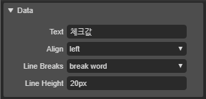

# 6.1.1. Label Appearance

Label 속성입니다. 글로벌 속성은[ **5. 글로벌 속성**](../../5./)을 참고해주세요.

* **Data** : 레이블의 텍스트 및 텍스트 정렬을 설정하는 속성입니다.
  * **Text** : 레이블의 텍스트를 설정하는 속성입니다.
  * **Align** : 레이블 텍스트의 정렬을 설정하는 속성입니다.
    * **left **: 텍스트를 좌측 정렬합니다.
    * **center **: 텍스트를 가운데 정렬합니다.
    * **right **: 텍스트를 추측 정렬합니다.
  * **Line Breaks** :  레이블의 텍스트 줄바꿈 옵션을 설정하는 속성입니다.
    * **break word** : 단어 단위로 줄바꿈을 실행합니다.
    * **break all** :  글자 단위로 줄바꿈을 실행합니다.
  * **Line Height** :  레이블 텍스트의 라인 높이를 설정하는 속성입니다. 레이블 높이만큼 설정할 경우 컴포넌트 세로 중간에 텍스트가 위치합니다.

