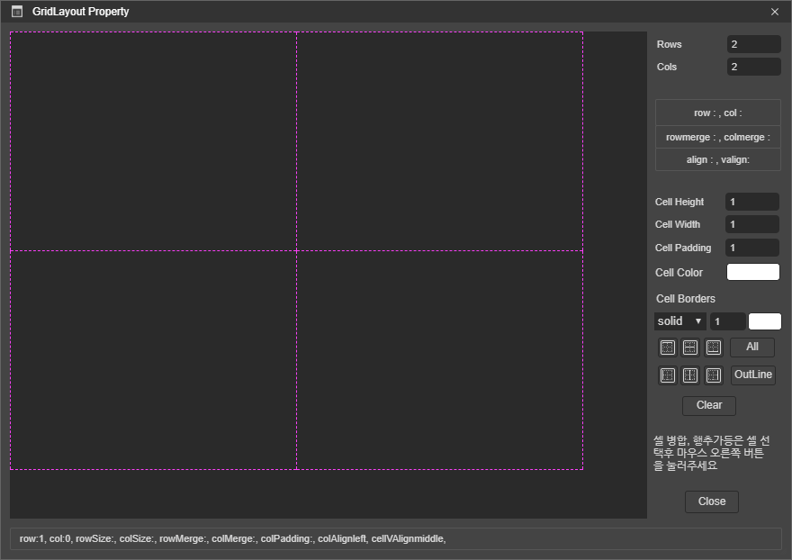
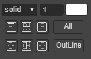
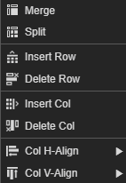

# 6.19.1. GridLayout Appearance

GridLayout 컴포넌트의 속성은 레이아웃에 배치후 더블 클릭을 통해서 설정 할 수 있습니다.

* **Rows **: 현재 로우의 총 개수
* **Cols **: 현재 컬럼의 총 개수
* **Cell Height** : 선택한 셀의 높이를 설정하는 속성입니다.
* **Cell Width** : 선택한 셀의 넓이를 설정하는 속성입니다.
* **Cell Padding** : 선택한 셀의 패딩을 설정하는 속성입니다.
* **Cell Color** : 선택한 셀의 배경색을 설정하는 속성입니다.
* **Cell Borders **: 
  * 
  *  선택된 셀의 top line만 border를 설정합니다.
  *  선택된 셀의 horizontal middle line 만 border를 설정합니다.
  *  선택된 셀의 bottom line만 border를 설정합니다.
  *  선택된 셀의 left line만 border를 설정합니다.
  *  선택된 셀의 vertical middle line만 border를 설정합니다.
  *  선택된 셀의 right line만 border를 설정합니다.
  * All : 선택된 셀의 모든 border를 설정합니다.
  * OutLine : 선택된 셀의 테두리 line만 border를 설정합니다.
  * Clear : 선택된 셀에 적용된 border를 초기화합니다.
* **Cell Context Menu **:
  * 
  * Merge :  현재 선택한 셀들을 하나의 셀로 합병합니다.
  * Split : Merge 된 셀을 Merge 전의 셀들로 분리합니다.
  * Insert Row : 현재 선택한 셀의 앞에 Row를 추가합니다.
  * Delete Row : 현재 선택한 셀의 Row를 삭제합니다.
  * Insert Col : 현재 선택한 셀의 앞에 Column을 추가합니다.
  * Delete Col : 현재 선택한 셀을 삭제합니다. 
  * Col H-Align : 현재 선택한 셀내의 element를 가로 정렬 합니다.
    * center : 셀 내의 element를 중앙 정렬 합니다.
    * left : 셀 내의 element를 좌측 정렬 합니다.
    * right : 셀 내의 element를 우측 정렬 합니다.
    * justify : 셀 내의 element를 넓이 만큼 사이즈를 조정 합니다.
  * Col V-Align : 현재 선택한 셀내의  element를 세로 정렬 합니다.
    * middle : 셀 내의 element를 세로 중앙에 정렬 합니다.
    * top : 셀 내의 element를 맨 상단으로 정렬 합니다.
    * bottom : 셀 내의 element를 맨 하단으로 정렬 합니다.
    * baseline : 셀 내의 element를 기준선에 맞추어 정렬 합니다.

