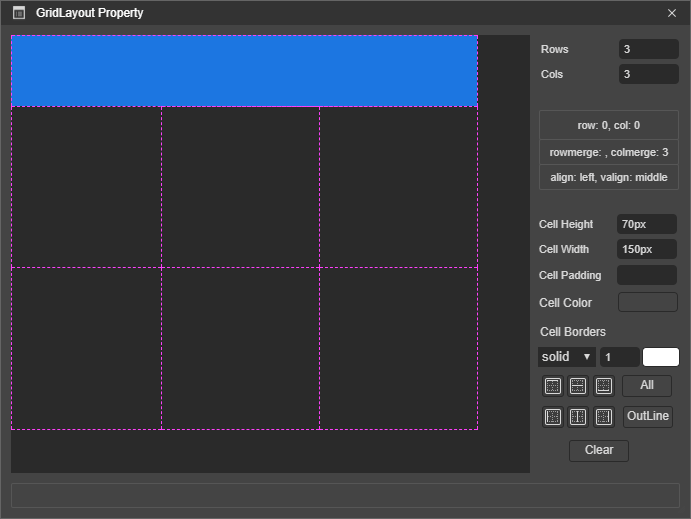
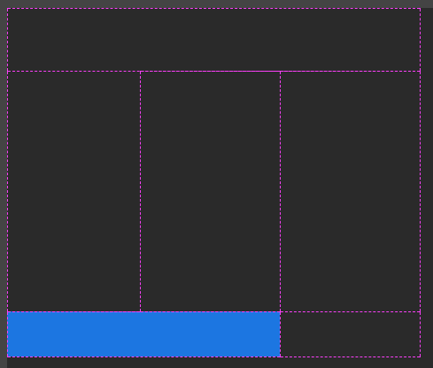
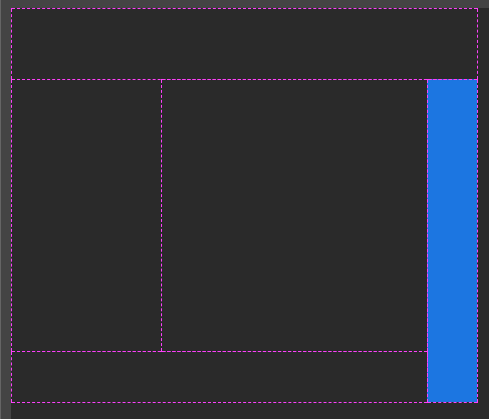
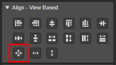
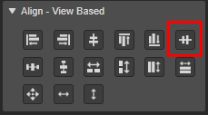
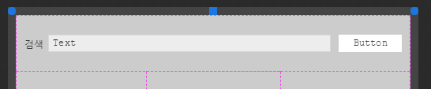
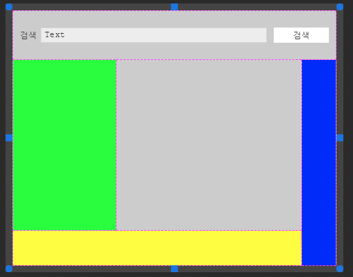
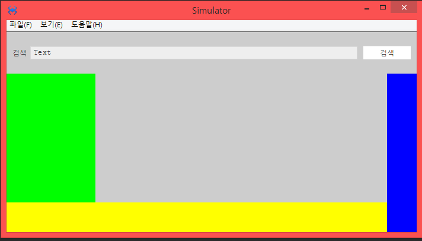
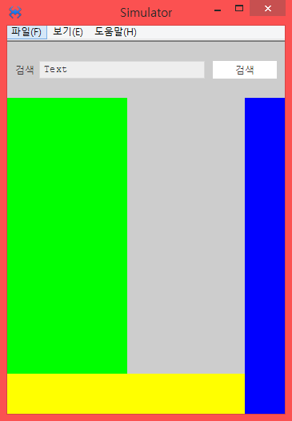

# 6.19.2. GridLayout Example

> Download : [http://manual.spidergen.org/example/SG009.zip](http://manual.spidergen.org/example/SG009.zip)

> ## **그리드레이아웃 컴포넌트는 뷰의 영역을 나누거나 레이아웃 분리를 위해 사용합니다.**

1. 새 프로젝트 SG009를 생성합니다.
2. MainView를 추가하고 SG009App.cls를 다음 내용과 같이 수정합니다.
   * > ```javascript
     > function SG009App:onReady()
     > {
     >     super.onReady();
     >
     >     var navigator = new ANavigator();
     >     navigator.registerPage('Source/MainView.lay', 'MainView');
     >     navigator.goPage('MainView');
     >
     > };
     > ```
3. MainView.lay 파일을 오픈하고 GridLayout 컴포넌트를 추가 합니다.
4. 추가한 GridLayout 컴포넌트를 선택하고 Placement &gt; Align-View Based &gt; Fill Parent 버튼을 이용해 GridLayout 컴포넌트가 뷰에 꽉 차게 조정합니다. 
5. 추가한 GridLayout 컴포넌트의 속성 다이얼로그를 오픈 합니다.
   * 오픈 방법은  GridLayout 컴포넌트를 더블 클릭합니다.
   * 또는 선택후 마우스 우측 버튼 클릭! 컨텍스트 메뉴를 오픈하고 Grid Layout Property 메뉴를 선택합니다.
6. GridLayout Property 다이얼로그에 다음과 같이 속성을 설정합니다.
   * Rows : 3, Cols : 3
   * 1행 1열을 선택하고 Cell Width:150px, Cell Height : 70으로 설정합니다.
   * 1행 1열, 1행 2열, 1행 3열 모든 컬럼을 선택\(드래그\)하고  Cell Context Menu에서 Merge 를 선택해서 셀을 병합 합니다.
     * 
   * 3행 1열을 선택하고 Cell Height : 50px로 설정합니다. 3행 1열, 3행 2열을 병합 합니다.
     * 
   * 2행 3열을 선택하고 Cell Width : 50px로 설정하고 2행 3열과 3행 3열을 같이 선택하고 병합니다.
     * 
7. 레이아웃이 5개의 영역으로 구분 되었습니다.
8. 1행 병합된 Cell 에 AView 를 드래그앤 드롭으로 추가합니다. 그리고 Palcement &gt; Align - View Based &gt; Fill Parent 적용해서 Cell안에 View 가득 차도록 합니다.
   * 
9. 병합된 Cell 내의 AView에 다음 내용을 참고해 컴포넌트를 배치합니다.

| compoonent | position | size | text |
| :--- | :--- | :--- | :--- |
| ALabel | left:10px, top:26px | width:auto, height:auto | 검색 |
| ATextField | left:40px, top:24px | w-stretch:100px, height:22px |  |
| AButton | right:10px, top:24px | width:80px, height:22px | 검색 |

* 세로 중간에 위 3개의 컴포넌트가 위치하게 하기 위해 3개의 컴포넌트를 모두 선택\(Ctrl + 선택객체\) 하고 Placement &gt; Align-View Based &gt; Middle 을 선택합니다.
  * 
* 
* 고정된 영역에 AView를 추가하고 앞 8번과 같이 추가한 뷰가 셀에 가득차게 하고 각 뷰의 컬러를 연두, 파랑, 노랑 색으로 설정합니다.
  * 
* F5 키를 이용해서 프로젝트를 빌드하고 실행합니다.
  * 시뮬레이터의 창 사이즈를 줄이거나 늘려 봅니다.
  * 고정 영역\(배경컬러가 있는 영역\)이 유지 되면서 유동적으로 레이아웃이 변경되는 걸 확인합니다.  
    * 
    * 

