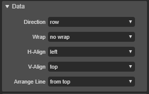

# 6.20.1. FlexLayout Appearance

* **Data** :
  * **Direction** : 자식 요소의 방향성을 설정하는 속성입니다.
    * row : 기본값. 자식 요소의 방향을 수평방향\(좌 -&gt; 우\)으로 표현합니다.
    * row reverse : 자식 요소의 방향을 수평방향\(우 -&gt; 좌\)으로 표현합니다.
    * column : 자식 요소의 방향을 수직방향\(상 -&gt; 하\)으로 표현합니다.
    * column reverse : 자식 요소의 방향을 수직방향\(하 -&gt; 상\)으로 표현합니다.
  * **Wrap** : 자식 요소의 줄넘김 처리를 설정하는 속성입니다.
    * no wrap :  기본값. 자식 요소를 한줄에 모두 표현합니다.
    * wrap : 자식 요소가 적정 길이보다 길면 다음줄에 표현합니다.
    * wrap reverse : wrap과 같으나 역방향으로 표현합니다.
  * **H-Align** : 자식 요소의 수평방향 정렬 속성입니다.
    * left :  자식요소를 한 덩어리로 묶어, 수평 방향의 시작점에 위치합니다.
    * center : 자식요소를 한 덩어리로 묶어, 수평 방향의 중앙에 위치합니다.
    * right : 자식요소를 한 덩어리로 묶어, 수평 방향의 끝점에 위치합니다.
    * space type1 : 컨테이너의 양쪽 끝에 맞추어 자식요소를 정력합니다.
    * space type2 :  컨테이너의 양쪽 끝에 동일한 간격의 공간을 갖고 각 자식요소 전, 후에 일정한 간격의 공간을 만든다. 
    * space type3 : 각 자식요소 전, 후에 일정한 간격의 공간을 만들어 정렬합니다.
  * **V-Align** : 자식요소의 수직방향 정렬 속성입니다.
    * top : 자식요소를 한 덩어리로 묶어, 수직 방향의 시작점에 위치합니다.
    * center : 자식요소를 한 덩어리로 묶어, 수직 방향의 중간점에 위치합니다.
    * bottom : 자식요소를 한 덩어리로 묶어, 수직 방향의 끝점에 위치합니다.
    * stretch : 자식요소를 한 덩어리로 묶어, 수직 방향의 시작점에서 끝점까지 늘립니다.
    * text baseline :  자식요소를 한 덩어리로 묶어, 수직 방향의 베이스라인에 위치합니다. 
  * **Arrange Line** :
    * from top :
    * from center :
    * from bottom :
    * stretch :
    * space between :
    * space around :

