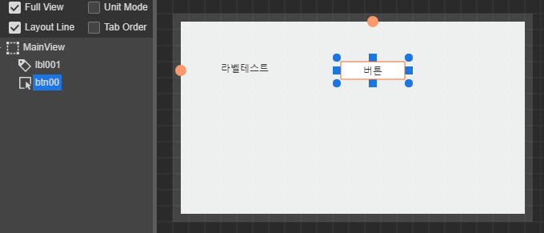
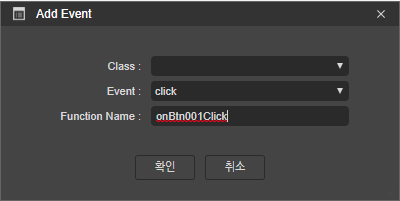
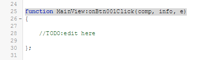
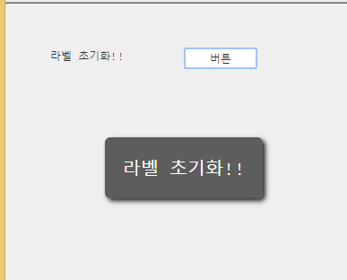

# 6.3.2. Button Example

> Download : [http://manual.spidergen.org/example/SG001.zip](http://manual.spidergen.org/example/SG001.zip)
>
> youtube : [https://youtu.be/\_\_N9J3ial0U](https://youtu.be/__N9J3ial0U)

1. 레이블 테스트를 위한 프로젝트를 오픈합니다.
   * File &gt; Open Project 클릭
   * 오픈된 탐색기에서 프로젝트 폴더\(c:\study\SG001\) 를 선택하고 SG001.prj 파일을 클릭합니다.
2. MainView.lay 파일을 오픈합니다.
3. MainView 레이아웃에 버튼 컴포넌트를 추가합니다.
   * **Placement Pane** :  
     * Position &gt; left : 200px,  top : 50px
     * Size &gt; width : 80px,  height : 22px
   * **Class Pane** :  
     * Identity &gt; ID : btn001
   * **Appearance Pane** : 
     * Data &gt; Text : 버튼,  Align : center
4. 다음과 같은 레이아웃 화면을 확인합니다. 
5. 버튼에 Click 이벤트를 설정합니다.
   * 설정 방법은 레이아웃에 배치한 버튼을 더블 클릭하거나 Class Pane에서 Event 목록에서 Click 이벤트 리스트 우측 영역을 클릭합니다.  
   * Add Event 다이얼로그에서 Function Name 을 확인\(함수명 변경 가능\) 하고 확인 버튼을 클릭합니다. 
   * 이벤트가 추가되면 해당 .cls 파일시 오픈되고 매핑된 이벤트 함수로 커서가 이동합니다. 
6. 추가된 매핑함수에 아래와 같이 버튼이 클릭될시 토스트 메시지를 출력하게 수정합니다.
   * > ```javascript
     > function MainView:onBtn001Click(comp, info, e)
     > {
     >
     >     AToast.show(this.lbl001.getText());
     >     
     > };
     > ```
7. 빌드해서 결과물을 확인합니다. 

