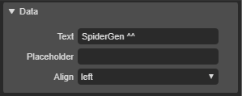

# 6.6.1. DropBox Appearance

* **Data** : 
  * **Text** : 드롭박스 텍스트를 설정하는 속성입니다.
  * **Placeholder** : 플레이스홀더 텍스트를 설정하는 속성입니다.
  * **Align** : 텍스트의 정렬을 설정하는 속성입니다.
    * left : 텍스트를 좌측정렬 합니다.
    * center : 텍스트를 중앙정렬 합니다.
    * right : 텍스트를 우측 정렬합니다.

