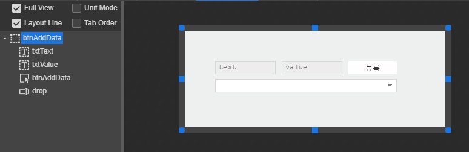
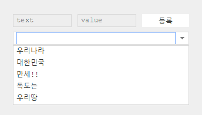
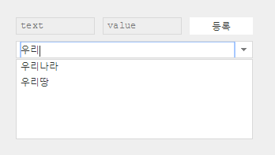

# 6.6.2. DropBox Example

> Download : [http://manual.spidergen.org/example/SG002.zip](http://manual.spidergen.org/example/SG002.zip)

1. 스파이더젠에서 SG002 프로젝트를 오픈합니다.
2. V002 이름으로 화면뷰를 추가합니다.
3. 어플리케이션 파일 SG002App.cls을 오픈하고 네비게이터에 V002 화면을 등록합니다.
   * > ```javascript
     > function SG002App:onReady()
     > {
     >     super.onReady();
     >
     >     var navigator = new ANavigator();
     >     navigator.registerPage('Source/Views/V001.lay', 'V001');
     >     navigator.registerPage('Source/Views/V002.lay', 'V002');
     >     navigator.goPage('V002');
     >
     > };
     > ```
4. V002.lay 파일을 오픈하고 다음과 같이 컴포넌트를 배치합니다.
   * 드롭박스에 Appearance Pane &gt; Display &gt; readonly 체크를 해지 합니다.

| component | id | position | size | text | placeholder |
| :--- | :--- | :--- | :--- | :--- | :--- |
| ATextField | txtText | left:50px, top:50px | width:100px, height:22px |  | text |
| ATextField | txtValue | left:160px, top:50px | width:100px, height:22px |  | value |
| AButton | btnAddData | left:270px, top:50px | width:80px, height:22px | 등록 |  |
| ADropBox | drop | left:50px, top:80px | width:300px, height:22px | - | - |



1. V002.lay 화면에서 등록 버튼을 더블 클릭해서 click 이벤트를 등록합니다.
   * > ```javascript
     > function V002:onBtnAddDataClick(comp, info, e)
     > {
     >
     >     //입력 텍스트와 데이터 값을 저장합니다.
     >     var iTxt = this.txtText.getText(),
     >         iData = this.txtValue.getText();
     >     
     >     if(iTxt.trim()=='' || iData.trim()=='')
     >     {
     >         AToast.show('텍스트와 데이터 내용을 입력하세요.');        
     >     }
     >     else
     >     {        
     >         this.drop.addItem(iTxt, iData); //드롭박스에 데이터를 추가합니다.
     >         
     >         //입력 초기화
     >         this.txtText.setText('');
     >         this.txtValue.setText('');
     >         
     >         AToast.show(iTxt + ',' + iData + ' 데이터를 추가');        
     >     }
     >     
     > };
     > ```
2. 이번에는 V002.lay 화면에서 드롭박스를 선택하고 Class Pane &gt; Event &gt; select 이벤트를 등록합니다. 이벤트명은 onDropSelect라고 사용합니다. 처리 내용은 드롭박스의 아이템이 선택되면 선택된 내용을 확인하는 토스트 메시지를 출력하도록 합니다.
   * > ```javascript
     > function V002:onDropSelect(comp, info, e)
     > {
     >     
     >     AToast.show(comp.getSelectedItemText() + ':' + comp.getSelectedItemData());
     >     
     > };
     > ```
3. 프로젝트를 빌드하고 실행합니다.
   * 실행 화면에서 데이터를 입력합니다. 입력 데이터 내용은 아래와 같습니다.
   * text : 우리나라, value : 1
   * text : 대한민국, value : 2
   * text : 만세!!, value : 3
   * text : 독도는, value : 4
   * text : 우리땅, value :5
4. 데이터를 입력하고 나면 드롭박스에 검색할 텍스트를 검색해봅니다.
   * 검색전 
   * 검색시작 

